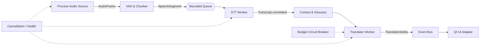

# Tawil Translate

面向 Windows 游戏与直播的低延迟、进程级实时翻译悬浮窗。

> 当前阶段：统一桌面程序已贯通进程级 WASAPI、Silero VAD、Faster-Whisper、OpenAI-compatible 流式翻译与透明悬浮窗，并提供免 Python 的 Windows 发布包。

## 设计目标

- 进程级 WASAPI Application Loopback，隔离无关系统声音
- Silero VAD + Faster-Whisper 本地 GPU 推理
- OpenAI 兼容的流式翻译 API
- PySide6 无边框、置顶、可穿透悬浮窗
- 有界队列与背压，避免推理速度下降时内存无限增长
- 字幕“锁定线”，已提交文本不会因 STT 回溯而跳动
- 词库注入、Token 预算和 API 熔断

## 优化后的架构



与最初按文件分层的方案相比，核心变化是：领域事件不依赖 Qt；所有外部能力通过 `Protocol` 注入；队列有明确容量；每条字幕有稳定 ID 和提交状态；UI 只订阅事件，不参与推理调度。

## 快速开始

要求 Python 3.11+。

```powershell
python -m venv .venv
.venv\Scripts\Activate.ps1
pip install -e ".[dev]"
python main.py --demo
python main.py --list-models
pytest
```

桌面依赖单独安装：

```powershell
pip install -e ".[desktop]"
python main.py --desktop
```

## 本地语音识别选项

所有选项都集成在同一个程序中，可在设置窗口切换；模型首次使用时由 Faster-Whisper 下载到 `models/`，后续离线加载。

| 档位 | 模型 / 计算方式 | 资源参考 | 适用场景 |
|---|---|---:|---|
| CPU / 兼容 | base / int8 | 无独显 | 兼容性优先、低功耗设备 |
| 极速 | small / int8_float16 | 约 1.2GB 显存 | 动作游戏、最低延迟 |
| 均衡（默认） | medium / float16 | 约 2.8GB 显存 | 大多数游戏和直播 |
| 高精度 | large-v3-turbo / float16 | 约 5.5GB 显存 | 剧情游戏、多口音内容 |

显存数字是近似规划值，实际占用会随驱动、音频长度和 CTranslate2 版本变化。高级配置可以覆盖模型名称、设备与量化类型。

## 模块优化摘要

- 音频：20ms 帧设计；回调线程只复制 PCM；进程捕获接口与 VAD 解耦。
- VAD/断句：零下载 Energy VAD 降级实现；短碎片合并；最长 8 秒硬上限。
- STT：模型懒加载、启动预热、单实例后台推理、四档资源配置。
- 翻译：SSE 增量显示、低温度提示词、词库约束、短上下文、超时和熔断。
- 管线：有界队列、可选背压策略、默认丢弃最旧片段保护实时性、统一取消。
- UI：Qt 原生窗口、文字描边、50ms 淡入、编辑/穿透双模式、非阻塞状态事件。
- 成本与状态：每日 Token 预算、稳定字幕 ID、端到端延迟指标、错误降级事件。

## 进程级音频捕获

桌面程序会列出并记忆目标游戏/直播进程。捕获层只接受原生 helper 输出的目标进程树 PCM，不会静默回退到全系统混音。系统要求 Windows 10 build 20348 或更高版本。

Python 与 helper 使用带长度帧的二进制 stdout 协议；诊断走 stderr。这样 COM/WASAPI 位于独立进程中，Qt 主线程不会参与音频回调。协议见 `native/audio_capture/README.md`。

原生 helper 现已包含在仓库并由 Windows CI 编译。发布包会把 helper 与 PyInstaller 桌面程序一起交付；用户运行 `scripts/install.bat` 即可安装，不需要预装 Python。首次选择 STT 档位并启动时，程序自动下载相应 Faster-Whisper 模型，并显示加载进度状态。

API Key 优先读取环境变量；也可以在设置窗口输入，密钥通过 Windows Credential Manager 保存，不会写入 JSON 配置或 Git 仓库。

## 目录

```text
main.py
src/tawil_translate/
  domain/        # 不依赖框架的事件和端口
  application/   # 管线编排、背压、预算控制
  infrastructure/# WASAPI/STT/LLM 适配器
  ui/            # Qt 展示适配器
configs/         # 示例配置与词库
scripts/         # Windows 安装与打包入口
tests/
```

详细设计见 [docs/architecture.md](docs/architecture.md)。

## 安全

API Key 仅从环境变量读取，不写入配置文件或日志。默认变量名为 `TAWIL_API_KEY`。

## License

MIT
