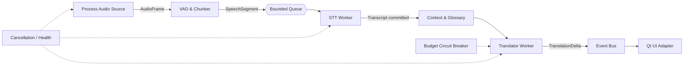

# Tawil Translate

面向 Windows 游戏与直播的低延迟、进程级实时翻译悬浮窗。

> 当前阶段：架构骨架与可运行的模拟管线。WASAPI、Faster-Whisper 和真实 LLM 适配器将按接口逐步接入。

## 设计目标

- 进程级 WASAPI Application Loopback，隔离无关系统声音
- Silero VAD + Faster-Whisper 本地 GPU 推理
- OpenAI 兼容的流式翻译 API
- PySide6 无边框、置顶、可穿透悬浮窗
- 有界队列与背压，避免推理速度下降时内存无限增长
- 字幕“锁定线”，已提交文本不会因 STT 回溯而跳动
- 词库注入、Token 预算和 API 熔断

## 优化后的架构



与最初按文件分层的方案相比，核心变化是：领域事件不依赖 Qt；所有外部能力通过 `Protocol` 注入；队列有明确容量；每条字幕有稳定 ID 和提交状态；UI 只订阅事件，不参与推理调度。

## 快速开始

要求 Python 3.11+。

```powershell
python -m venv .venv
.venv\Scripts\Activate.ps1
pip install -e ".[dev]"
python main.py --demo
pytest
```

桌面依赖单独安装：

```powershell
pip install -e ".[desktop]"
```

## 目录

```text
main.py
src/tawil_translate/
  domain/        # 不依赖框架的事件和端口
  application/   # 管线编排、背压、预算控制
  infrastructure/# WASAPI/STT/LLM 适配器
  ui/            # Qt 展示适配器
configs/         # 示例配置与词库
scripts/         # Windows 安装与打包入口
tests/
```

详细设计见 [docs/architecture.md](docs/architecture.md)。

## 安全

API Key 仅从环境变量读取，不写入配置文件或日志。默认变量名为 `TAWIL_API_KEY`。

## License

MIT

